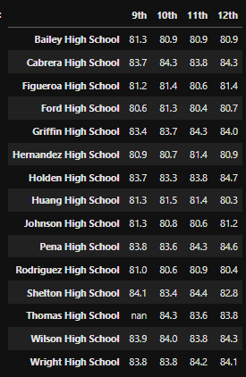

# School_District_Analysis

## Overview of the school district analysis
School board analysis for two cvs files, students_complete.cvs and school_complete.cvs where we will get the key district metrics, presented in a table format. 

List of deliverables for the analysis of the school district: 
- A high-level snapshot of the district's key metrics, presented in a table format
- An overview of the key metrics for each school, presented in a table format
- Tables presenting each of the following metrics:
    - Top 5 and bottom 5 performing schools, based on the overall passing rate
    - The average math score received by students in each grade level at each school
    - The average reading score received by students in each grade level at each school
    - School performance based on the budget per student
    - School performance based on the school size 
    - School performance based on the type of school
    
The school board has notified us that the school_complete.cvs file shows evidence of academic dishonesty, for reading and math grades for Thomas High School ninth graders, appear to have been altered. They asked to replace the math and reading scores for Thomas High School with NaNs while keeping the rest of the data intact.

## Results
1. District summary original vs modified 

2. School summary original vs modified for Thomas High School

Here we can see there is an increase in percetages for % Passing Math,	% Passing Reading and % Overall Passing.

  
  
  
3. High and Low Performing Schools  
      
      a. Top Schools  
       
         
         
      Here we can see that Thomas High School is performing in the top school. Now Thomas High School is in second best perfoming schools.  
      
    
      b. Bottom Schools
      
      
      

4. Replacing 9th grade scores affected the following
      
       a. Math and reading scores bye grades
        
       Math. In the second chart a NaN i set for the 9th graders 
         
          
        
       Reading. In the second chart a NaN i set for the 9th graders
        
      
       b. Scores by school spending
       The socores by school spending increases overall
        
        
       c. Scores by type
        
        

## Summary
We can determine that there is a big change for reading and math scores for Thomas High School. It changes to second best perfimg school in the district. It also changes the percentage of passing students for math and reading.
